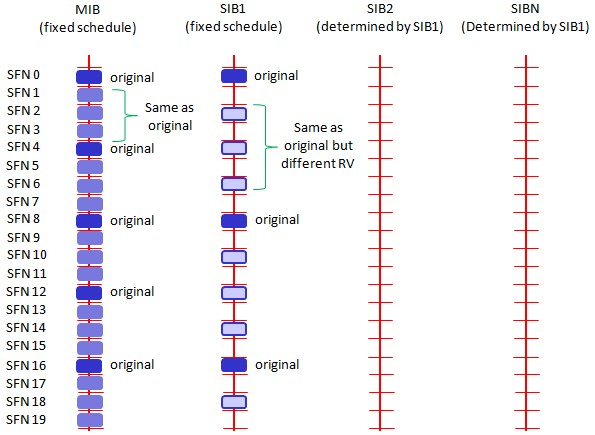

== 系统信息解析

=== 概述
LTE系统内分为MIB和SIB系列消息, 对于UE当新接入一个小区或广播消息发生改变时, 都会接收系统信息(MIB\SIB), 以帮助更新或纠正UE当前的状态, 完成相应的通信业务和物理过程. 在系统路测中可以观察的系统信息有种: MIB, SIB1和SI, 其作用分别如下. 

- MIB:用于系统接入. MIB上传输几个比较重要的系统信息参数, 如小区下行带宽, PHICH配置参数, 无线系统帧号SFN(包含SIB1消息的位置), 在PBCH上发送, 表现为"RRC_MASTER_INFO_BLOCK". 
- SIB1:广播小区接入与小区选择的相关参数以及SI消息的调度信息(包含了一个或多个SIB2-13消息), 在PDSCH上发送, 表现为"RRC_SIB_TYPE1". 
- SI:SI消息中承载的是SIB2-SIB13, 在PDSCH上发送, 表现为"RRC_SYS_INFO". 
* SIB2:小区内所有UE共用的无线参数配置, 其它无线参数基本配置. 
* SIB4:同频邻区列表以及每个邻区的重选参数, 同频白/黑名单小区列表. 
* SIB5:异频相邻频点列表以及每个频点的重选参数, 异频相邻小区列表以及每个邻区的重选参数, 异频黑名单小区列表. 
* SIB6:UTRA FDD邻频频点列表以及每个频点的重选参数, UTRA TDD邻频频点列表以及每个频点的重选参数.(WCDMA) 
* SIB7:GERAN邻频频点列表以及每个频点的重选参数. 
* SIB8:CDMA2000的预注册信息, CDMA2000邻频频段列表和每个频段的重选参数, CDMA2000邻频频段的邻区列表. 
* SIB9:Home eNodeB的名称. 
* SIB10:ETWS主信息(primary notification). 
* SIB11:ETWS辅信息(secondary notification). 
* SIB12:CMAS信息(CMAS notification). 
* SIB13:请求获取跟一个或多个MBSFN区域相关的MBMS控制信息的信息. 

=== MIB (Master Information Block)解析
MIB主要包含系统带宽, PHICH配置信息, 系统帧号. (下图为实测信令)

image::images/mib.jpg[title="mib",align="center"]

DL_Bandwidth::
系统带宽, 范围enumerate(1.4M(6RB, 0), 3M(15RB, 1), 5M(25RB, 2), 10M(50RB, 3), 15M(75RB, 4), 20M(100RB, 5)), 上图为n100, 对应的系统带宽为20M(100RB, 带宽索引号为5). 
Phich_Config::
- 参见 http://blog.sina.com.cn/s/blog_927cff010101bhbi.html[PHICH分析一]
- 参见 http://blog.sina.com.cn/s/blog_927cff010101bhck.html[PHICH分析二]

Phich_Duration::
当该参数设置为normal时, PDCCH占用的OFDM符号数可以自适应调整; 当该参数设置为extended时, 若带宽为1.4M, 则PDCCH占用的OFDM符号数可以取3或4, 对于其他系统带宽下, PDCCH占用的符号数只能为3. 

[align="center", width="90%", options="header"]
.Phich_Duration
|==============================================
^|             2+|非MBSFN子帧                       |MBSFN子帧
^|PHICH持续时间 |帧结构类型2中的子帧1和子帧6 |其他情况 |同时支持PDSCH和PMCH的载波
^|Normal       |1 |1 |1
^|Extended     |2 |3 |2
|==============================================

PHICH-Resource::
该参数用于计算小区PHICH信道的资源; 
SystemFrameNumber::
系统帧号. 系统帧号, 用于UE获取系统时钟. 实际SFN位长为10bit, 也就是取值从0-1023循环. 在PBCH的MIB广播中只广播前8位, 剩下的两位根据该帧在PBCH 40ms周期窗口的位置确定, 第一个10ms帧为00, 第二帧为01, 第三帧为10, 第四帧为11. PBCH的40ms窗口手机可以通过盲检确定. 
Spare::
预留的, 暂时未用

=== SIB1 (System Information Block 1) 解析
SIB1上主要传输评估UE能否接入小区的相关信息及其他系统信息的调度信息. 主要包括4部分: 

- 小区接入相关信息(cell Access Related Info)
* PLMN Identity List, PLMN Identity, TA Code, Cell identity & Cell Status
- 小区选择信息(cell Selection Info)
* Minimum Receiver Level
- 调度信息(scheduling Info List)
* SI message type & Periodicity, SIB mapping Info, SI Window length
- TDD配置信息(tdd-Config)

.SIB1
----
MS1
System Information Block Type1 (DL-BCCH-SCH)

Time : 15:57:43.004
Vendor Header
  Length : 47
  Log Code (Hex) : 0xB0C0
  HW Timestamp : (63622381.25 ms) 17:40:22.381
    1.25 ms fraction : 0.00
    CFN : 136
    1.25 ms counter : 867576017905
  RRC Signaling Header
    Log Packet Version : 2
    RRC Release Number : 9.5.0
    Radio Bearer Id : 0
    Physical Cell Id : 2
    E-ARFCN : 39150
    System Frame Number
      System frame number : N/A
      Sub frame number : N/A
    Message Type : BcchSchDownlink
    Message Length : 22
plmn-IdentityList                                               <1>
  PLMN-IdentityList :
    [0 ] :
      plmn-Identity
        mcc
          MCC :
            [0 ] : 0
            [1 ] : 0
            [2 ] : 1
        mnc
          MNC :
            [0 ] : 0
            [1 ] : 1
      cellReservedForOperatorUse : notReserved
trackingAreaCode : 12594 (0x3132)                               <2>
cellIdentity : 2 (0x2)                                          <3>
cellBarred : notBarred                                          <4>
intraFreqReselection : allowed                                  <5>
csg-Indication : False                                          <6>
q-RxLevMin : -65                                                <7>
q-RxLevMinOffset : 1                                            <8>
p-Max : 23                                                      <9>
freqBandIndicator : 40                                          <10>
schedulingInfoList                                              <11>
  SchedulingInfoList :
    [0 ] :
      si-Periodicity : rf16                                     <12>
      sib-MappingInfo
        SIB-MappingInfo :
          [0 ] :
            extensionBit0 : 0
            Optionalitem : sibType3                             <13>
          [1 ] :
            extensionBit0 : 0
            Optionalitem : sibType5
    [1 ] :
      si-Periodicity : rf128
      sib-MappingInfo
        SIB-MappingInfo :
          [0 ] :
            extensionBit0 : 0
            Optionalitem : sibType6
          [1 ] :
            extensionBit0 : 0
            Optionalitem : sibType7
tdd-Config
  subframeAssignment : sa2                                      <14>
  specialSubframePatterns : ssp7                                <15> 
si-WindowLength : ms20                                          <16>
systemInfoValueTag : 0                                          <17>

Message dump (Hex):
    70 40 04 03 31 32 00 00 00 29
    14 6B 38 48 80 28 21 91 3D 00
    00 00

----

<1> PLMN标识列表(0-6)
<2> TAC跟踪区(0-65546) 消息中(0x3132)为16进制数, 转换成十进制为12594
<3> 小区ID实际是ECI, 与核心网中的数据相同, 其中089055为ENB ID标识, 0A为小区标识(此数字必须是2位16进制数, 才能与16进制的ENB ID进行组合成ECI), 如果ENB ID和小区ID都是十进制数的话, ECI=10进制的ENB ID * 256+ 10进制cell ID
<4> 小区禁止: 小区是否禁止UE驻扎, notBarred表示不禁止
<5> 同频重选: 允许; 用来控制当更高级别的小区禁止接入时, 能否重选同频小区
<6> 指示这个小区是否为CSG小区. 当csg-Indication设置为1(true)时, 只有当消息中的CSG(Closed Subscriber Group关闭用户组)标识和UE中存储的CSG列表中的一项匹配时, 此UE才能接入小区. 这个主要是用在R9的家庭基站中的概念, 用于家庭基站对用户接入的控制. FALSE表示不启用. 
<7> 指示小区要求的最小接收功率RSRP(-140..-44)dBm, 即当UE测量小区RSRP低于该值时UE是无法在该小区驻留的. 实际的值为: Q~rxlevmin~ = IE value * 2[dB]
<8> 小区选择所需要的最小接收电平偏移,(2-16)dB 
//这个的作用不大理解
<9> 小区支持UE允许的最大发射功率,如果eNB配置大于UE支持最大值, UE就设置为UE支持的最大值. 例如Cat3 UE支持最大23db
<10> 频带指示, 表示当前系统的使用40频段
<11> 调度信息表
<12> SI消息的调度周期, 以无线帧为单位. 如rf16表示周期为16个无线帧
<13> 系统消息中所含的系统信息块映射表. 表中没有包含SIB2, 它一直包含在SI消息中的第一项. 该字段决定了该小区能下发的sib(3到11)类型. 以上调度信息表示SIB3的周期和位置. 
<14> 用于指示上下行子帧的配置, sa2对应配置2. 详见 <<tab_UD_conifg>>
<15> 特殊子帧配比. 详见 <<tab_special_conifg>>
<16> 系统消息调度窗口,20ms
<17> 指示其它SIB是否发生了改变 详见 <<si_value_tag, systemInfoValueTag解析>>

[[tab_UD_conifg]]
[align="center", width="90%"]
.TD LTE uplink-downlink configuration
|==============================================
.2+^|Uplink-downlink configuration .2+^|Downlink-to-Uplink Switch-point periodicity 10+^|Subframe number
         |0 |1 |2 |3 |4 |5 |6 |7 |8 |9 
|0 |5ms  |D |S |U |U |U |D |S |U |U |U
|1 |5ms  |D |S |U |U |D |D |S |U |U |D 
|2 |5ms  |D |S |U |D |D |D |S |U |D |D 
|3 |10ms |D |S |U |U |U |D |D |D |D |D 
|4 |10ms |D |S |U |U |D |D |D |D |D |D 
|5 |10ms |D |S |U |D |D |D |D |D |D |D 
|6 |5ms  |D |S |U |U |U |D |S |U |U |D 
|==============================================
// 配置6怎么说是5ms? 

[[tab_special_conifg]]
[align="center", width="90%"]
.TD LTE uplink-downlink configuration
|==============================================
.2+^|特殊子帧配置  3+^|Normal CP(常规CP)1ms14个码
| DwPTS | GP | UpPTS
| 0     | 3  | 10    | 1
| 1     | 9  | 4     | 1
| 2     | 10 | 3     | 1
| 3     | 11 | 2     | 1
| 4     | 12 | 1     | 1
| 5     | 3  | 9     | 2
| 6     | 0  | 3     | 2
| 7     | 10 | 2     | 2
| 8     | 11 | 1     | 2
| 9     | 6  | 6     | 2
|==============================================
// 配置6怎么说是5ms? 

[[si_value_tag, systemInfoValueTag解析]]

[big]#systemInfoValueTag解析#

对于除MIB, SIB1, SIB10和SIB11之外的所有系统信息块的公共值, 范围(0-31); SI每变化一次, systemInfoValueTag值就加1(或减1: 移动研究院测试华为网络机制是减1). 

举例: UE将寻呼消息PAGING TYPE1中的MIB value tag1与自己保存的MIB value tag2进行比较:

1. 如果这两个Tag不同的话, 认为SI已经更新, 重新读取SI. 
2. 当重新获取得的systemInfoValueTag3与systemInfoValueTag1相同, 而systemInfoValueTag2不同的话, 读取MIB中的调度内容, 进行系统消息更新. 
3. 如果自己保存的systemInfoValueTag2与重新接收的systemInfoValueTag3相同, 而与寻呼消息中的systemInfoValueTag1不同的话, 认为MIB还没有广播下来, 等下一个MIB. 

===  SIB2 (System Information Block 2) 解析
* SIB2包含对所有UE适用的无线资源配置信息
* SIB2包含通用和共享信道配置, RACH相关配置, 定时器, 上行功控
* 没有SIB2会导致UE无法初始化ATTACH流程
* SIB2消息不一定显式的包含在SIB1调度信息中, 但是它总是映射在IB1消息中schedulingInfoList的第一个实体

.SIB2
....
MS1
System Information Block 2

Time : 17:45:31.000
ac-BarringForEmergency : False
ac-BarringForMO-Signalling
  ac-BarringFactor : p95
  ac-BarringTime : s8
  ac-BarringForSpecialAC : 00000
    [0 ] : 0
    [1 ] : 0
    [2 ] : 0
    [3 ] : 0
    [4 ] : 0
ac-BarringForMO-Data
  ac-BarringFactor : p95
  ac-BarringTime : s8
  ac-BarringForSpecialAC : 00000
    [0 ] : 0
    [1 ] : 0
    [2 ] : 0
    [3 ] : 0
    [4 ] : 0
radioResourceConfigCommon
  rach-ConfigCommon                                             <1>
    numberOfRA-Preambles : n52                                  <2>
    sizeOfRA-PreamblesGroupA : n44                              <3>
    messageSizeGroupA : b56                                     <4>
    messagePowerOffsetGroupB : dB5                              <5>
    powerRampingStep : dB2                                      <6>
    preambleInitialReceivedTargetPower : dBm-90                 <7>
    preambleTransMax : n20                                      <8>
    ra-ResponseWindowSize : sf10                                <9>
    mac-ContentionResolutionTimer : sf48                        <10>
    maxHARQ-Msg3Tx : 8                                          <11>
  bcch-Config
    modificationPeriodCoeff : n4                                <12>
  pcch-Config
    defaultPagingCycle : rf64                                   <13>
    nB : oneT                                                   <14>
  prach-Config
    rootSequenceIndex : 22                                      <15>
    prach-ConfigInfo
      prach-ConfigIndex : 0                                     <16>
      highSpeedFlag : False                                     <17>
      zeroCorrelationZoneConfig : 1                             <18>
      prach-FreqOffset : 10                                     <19>
  pdsch-ConfigCommon
    referenceSignalPower : -10                                  <20>
    p-b : 1                                                     <21>
  pusch-ConfigCommon
    n-SB : 2                                                    <22>
    hoppingMode : interSubFrame                                 <23>
    pusch-HoppingOffset : 6                                     <24>
    enable64QAM : True                                          <25>
    ul-ReferenceSignalsPUSCH
      groupHoppingEnabled : False                               <26>
      groupAssignmentPUSCH : 0                                  <27>
      sequenceHoppingEnabled : False                            <28>
      cyclicShift : 0                                           <29>
  pucch-ConfigCommon
    deltaPUCCH-Shift : ds1                                      <30>
    nRB-CQI : 2                                                 <31>
    nCS-AN : 0                                                  <32>
    n1PUCCH-AN : 2                                              <33>
  soundingRS-UL-ConfigCommon
    SoundingRS-UL-ConfigCommon : release
  uplinkPowerControlCommon
    p0-NominalPUSCH : -80                                       <34>
    alpha : al1                                                 <35>
    p0-NominalPUCCH : -100                                      <36>
    deltaFList-PUCCH
      deltaF-PUCCH-Format1 : deltaF-2                           <37>
      deltaF-PUCCH-Format1b : deltaF3
      deltaF-PUCCH-Format2 : deltaF-2
      deltaF-PUCCH-Format2a : deltaF2
      deltaF-PUCCH-Format2b : deltaF2
    deltaPreambleMsg3 : 4                                       <38>
  ul-CyclicPrefixLength : len1                                  <39>
ue-TimersAndConstants
  t300 : ms1000                                                 <40>
  t301 : ms1000                                                 <41>
  t310 : ms1000                                                 <42>
  n310 : n1                                                     <43>
  t311 : ms1000                                                 <44>
  n311 : n8
additionalSpectrumEmission : 1                                  <45>
timeAlignmentTimerCommon : infinity                             <46>
....

<1> 随机接入配置
<2> 保留给竞争模式使用的随机接入前导码个数, n52即52个
<3> 随机接入前导码组A的大小. 对于所有用于竞争随机接入的前导码, eNodeB可以选择性的将其分为两组, 称为集合A和集合B. 触发随机接入时, UE首先根据待发送的Msg3大小和路损大小确定使用哪个集合. 集合A用于Msg3较小或路损较大的场景; 集合B用于Msg3较大且路损较小的场景.n44:前导码组A包含44个前导码, B组52-44=8个前导码
<4> Msg3消息块大小门限, 针对Preamble码集合A. 如果Group B存在, 则在选择Preamble码的集合时, 考察: 如果Msg3的大小大于该门限, 同时满足UE的路损小于: PCMAX – preambleInitialReceivedTargetPower– deltaPreambleMsg3 – messagePowerOffsetGroupB的门限值, 则选择Group B; 否则就选择Group A. b56表示56bit.
<5> 用于配合判决UE随机接入Preamble B组的选择
<6> 随机前导码的发射功率调整步长. dB2表明2个dB
<7> eNodeB期望接收到的初始随机前导码的功率.当PRACH前导格式为0时, 在满足前导检测性能时, eNodeB所期望的目标功率水平. 
<8> 随机接入前导最大重发次数. 如果初始接入过程失败, 但是还没有达到最大尝试次数preambleTransMax, 则可以继续尝试. 如果达到最大次数, 则本次随机接入过程结束
<9> 随机接入响应窗大小. 若在窗口期未收到RAR, 则上行同步失败.Sf10表示10个子帧的长度. 响应窗起点与Msg1间隔10ms(发送了接入前导序列以后, UE需要监听PDCCH信道,是否存在ENODEB回复的RAR消息, (Random Access Response), RAR的时间窗是从UE发送了前导序列的子帧 + 3个子帧开始, 长度为Ra-ResponseWindowSize个子帧)
<10> RA过程中UE等待接收Msg4的有效时长. 当UE初传或重传Msg3时启动. 在超时前UE收到Msg4或Msg3的NACK反馈, 则定时器停止. 定时器超时, 则随机接入失败, UE重新进行RA. 当前参数设置sf48, 即48个子帧长度. 
<11> Msg3的HARQ最大传输次数, 该参数与preambleTransMax的区别, 该参数是在一次preamble码接入成功的基础上Msg3可以自动重传的次数
<12> 系统消息更新周期系数, n2就是2. 在UE没有得到其他通知的情况下, LTE 规定 UE存贮的系统信息的有效期为3小时. LTE中, 系统信息的改变只能在特定的系统帧上进行, 这些特定的帧满足条件: SFN帧号 mod 系统消息更新周期 = 0; 其中系统消息更新周期 = modificationPeriodCoeff * defaultPagingCycle.
<13> 默认的寻呼周期. 当前参数设置rf128, 即128个无线帧长度
<14> 默认寻呼周期的系数. oneT, 即生效的默认寻呼周期=1*默认寻呼周期
<15> 用于生成Signature的逻辑Za-doff序列索引, 每一个逻辑索引对应一个物理Zadoff-chu序列. 该值一般是按网络规划配置设置的. 当前参数设置为7, 对应物理Zadoff-chu序列为629.见36.211 Table 5.7.2-4
<16> PRACH 配置索引, 用于指示无线帧中的PRACH时频位置, 取值范围为0 ~ 63, 不同的取值对应不同个数个PRACH信道. 对于TDD, 由于上行子帧较少, 一个subframe可以有多个PRACH, 但最多为6个. 见36.211 Table 5.7.1-2
<17> 高速移动小区指示. 即是否是覆盖高速移动场景, 当前参数设置为False, 表示非覆盖高速移动场景
<18> 零自相关区配置索引. 随机接入前导是由具有CAZAC(恒幅零自相关)的Zadoff-chu序列生成的, 通过逻辑根序列获取物理根序列, 然后对物理根序列进行循环移位获得. 零自相关区配置索引与Ncs的选择直接相关. 取值范围0～15, 当前参数设置为2, 即对应Ncs=15(无限集)或Ncs=22(有限集), 见36.211 Table 5.7.2-2
<19> 该参数用于广播PRACH所占用的频域资源起始位置的偏置值码当前参数设置为10, 即在第10个PRB位置
<20> 每逻辑天线(port)的小区参考信号功率. 下行参考信号传输功率定义为系统带宽内所有承载小区专用参考信息的资源粒子功率的线性平均.参数设置值为-10, 即RS信号功率为-10dbm
<21> 表示PDSCH上EPRE(Energy Per Resource Element)的功率因子比率指示, 它和天线端口共同决定了功率因子比率的值,P-b实际表征的是有RS的PDSCH符号功率与没有RS的PDSCH符号的功率偏移量 见36.213 Table 5.2-1
<22> 给定跳频模式下, 用于跳频的PUSCH子带个数. 该参数与跳频偏置决定了子带的大小, 而子带大小与跳频偏置, Vrb数一起决定PUSCH信道PRB的分配. 该参数设置为2, 即子带数为2.
<23> PUSCH跳频模式选择. 该参数设置为interSubFrame, 表示采用子帧间跳频模式. 还有另一种模式为子帧内跳频. 不同跳频模式下pusch发送信号使用的资源块获得方式不一样
<24> PUSCH信道的跳频偏移. 与FDD/TDD模式, 子帧配置, CP长度相关. 参与决定PUSCH信道资源分配. 
<25> 上行PUSHC是否使用64QAM调制方式. CAT5类终端支持. 当前参数设置为TRUE, 表示上行支持64QAM使用. 
<26> 是否允许组跳频. 所谓序列组跳, 是指小区在不同的时隙内, 使用不同序列组内的参考序列. 在非序列组跳转的情况下, 也就是说, 在不同的时隙内, 小区的参考序列都来自同一个参考序列组. 在PUCCH的情况下, 序列组的序号是小区的PCI模30后的余值. 其中, PCI在0到503之间取值. 对于PUSCH使用的序列组是通过SIB2中的参数"groupAssignmentPUSCH"来显式通知UE的. 这样做的目的是允许相邻的小区使用相同的参考信号根序列. 通过相同根序列的不同循环移位来使相邻小区的不同UE之间的RS相互正交. false, 则表示不支持
<27>  PUSCH信道的分组指派; 一个eNodeB下所有小区的GroupAssignPUSCH取0时, 这些的PUSCH上的UL RS由不同的base序列组生成, 每个小区在生成UL RS时可以使用全部的CS(Cyclic Shift)取值, 可用的CS越多, 能够支持配对的V-MIMO用户越多. 
<28> 是否允许USCH信道的序列跳频; 当不执行Group hopping时, 允许支持sequence hopping
<29> PUSCH信道的循环移位; 当一个eNodeB下的所有小区使用相同的base序列组生成PUSCH上的UL RS时, 为了保证在半静态调度时这些小区使用不同的CS(Cyclic Shift)取值, 需要为这些小区配置不同的CyclicShift取值
<30> PUCCH信道的循环移位间隔. 在组网时根据环境类型获得小区的平均时延扩展, 然后根据小区的平均时延扩展得到PUCCH信道的循环移位间隔. 与硬件处理能力相关.协助计算pucch格式1, 1a, 1b时的循环移位及正交序列索引的确定. 
<31> 表示每个时隙中可用于PUCCH格式2/2a/2b 传输的物理资源块数.RRC层给CQI配置的RB总数. 当PUCCH资源调整开关关闭时, CQI RB个数才能够进行手动配置. 参数设置为1, 表示1个RB用于承载CQI.该参数定义与36.211 5.4章节描述不一致.规范中定义为不同PUCCH格式下一个Slot可用带宽, 即RB数
//不清楚
<32> 表示的是PUCCH格式1/1a/1b和格式2/2a/2b在一个物理资源块中混合传输时格式1/1a/1b可用的循环移位数. 是delta PUCCH Shift的整数倍
<33> PUCCH占用RB数索引, 表示PUCCH 使用的RB 个数.
<34> PUSCH的标称P0值, 应用于上行功控过程. 与p0-NominalPUCCH含义一致
<35> 即α, 路径损耗补偿因子, 应用于上行功控过程. 是一个 3bit 的小区专用参数, 01代表0.1
<36> 正常进行PUCCH解调, eNodeB所期望的PUCCH发射功率水平; P0NominalPUCCH设置的过高, 会增加本小区的吞吐量, 但是会降低整网的吞吐量; P0NominalPUCCH设置偏低, 降低对邻区的干扰, 导致本小区的吞吐量的降低, 提高整网吞吐量. 
<37> PUCCH格式1的Delta值; 用于计算PUCCH信道功率, 相当于对每种PUCCH格式补偿值. 当前设置值deltaF-2, 表示-2dB
<38> 用于随机接入响应许可的PUSCH的功率计算. 实际值= IE value * 2 [dB],4*2=8 
<39> 小区的上行循环前缀长度, 分为普通循环前缀和扩展循环前缀, 扩展循环前缀主要用于一些较复杂的环境, 如多径效应明显, 时延严重等. 当前参数设置为len1, 即采用扩展循环前缀. 
<40> RRC连接建立定时器. 开始于RRCConnectionRequest发送, 在收到RRCConnectionSetup或RRCConnectionReject消息, cell re-selection或连接放弃后停止, 定时器超时后,则认为本次 RRC 建立失败, UE直接进入RRC_IDLE态. 参数设置值为1000ms. 
<41> RRC连接重建定时器. UE在发送RRCConnectionReestabilshmentRequest时启动该定时器.  定时器超时前, 如果UE收到RRCConnectionReestablishment或者RRCConnectionReestablishmentReject或者被选择小区变成不适合小区(适合小区定义参见3GPP TS 36.331), 则停止该定时器. 定时器超时后, UE进入RRC_IDLE态. 参数设置为1000ms. 
<42> 无线链路失败定时器.在收到底层连续N310个失步指示后启动, 若在定时器时间内收到连续N311个同步指示, 无线链路恢复, 否则定时器超时, 即意味着无线链路失败. 参数设置值为1000ms
<43> 该参数表示接收到底层的连续"失步"指示的最大数目. 改小, 可能增加重建次数, 改大可能无法及时检测到下行失步, 影响用户业务时延感受. 
<44> 无线链路失败恢复定时器. UE 在发起 RRC 连接重建流程时启动该定时器.  定时器超时前, 如果 UE 选择了一个 EUTRAN 小区或者异系统小区后, 停止此定时器. 定时器超时后, UE 进行小区重选或者TA更新, 进入 RRC_IDLE 态. 改小此参数对掉话率有负增益. 改大此参数影响用户业务时延感受, 可以减少掉话次数. 
<45> 附加频率散射, 限制UE功率在相应信道带宽内的水平. 即用于计算ue的上行发射功率. 这个参数对应一个Additional Maximum Power Reduction (A-MPR), 该值可以计算对应频带的上行发射功率. 该参数与Additional Maximum Power Reduction (A-MPR)的对应关系, 见 TS 36.101 Table6.2.4-1和TS 36.521 Table 6.2.4.3-1.当前参数设置值为1, 对应NS_01, 即A-MPR为NA. 
<46> 时间调整定时器, 上行同步成功后启动, 失步后重启. 这个参数是MAC层过程参数, 是对UE上行同步状态进行维护的一个定时器. UE上行需要保持和eNodeB的同步 , 同步是利用Rach信道和过程获得的. 但是UE一次做完一次Rach, 获得同步以后, 可能由于UE, eNodeB双方的时钟偏移, 或者信道情况改变, 而又变成失步状态. 在Time Alignment Timer超时的时间内, eNodeB必需对UE的上行定时做一次调整(eNB会给UE发Timing Advance Command来调整上行同步), 或者确认, 否则UE认为上行失步, 需要重新Rand Access. 例如: 在随机接入过程的Msg2中, 基站通常会返回给UE一个TA(时间提前量), 这是为了保证Msg3的同步, sf1920, 子帧为单位, 即1920个子帧长度
//不是很清楚意思

=== SIB3 (System Information Block 3) 解析
* SIB3包含了用于同频, 异频, 异系统间小区重选的基本共用信息
* 除临区相关信息之外的同频小区重选信息

.SIB3
....
MS1
System Information Block 3                                      <1>

Time : 17:45:36.299
q-Hyst : dB3                                                    <2>
s-NonIntraSearch : 22                                           <3>
threshServingLow : 15                                           <4>
cellReselectionPriority : 7                                     <5>
q-RxLevMin : -60                                                <6>
p-Max : 23                                                      <7>
s-IntraSearch : 19                                              <8>
allowedMeasBandwidth : mbw100                                   <9>
presenceAntennaPort1 : False                                    <10>
neighCellConfig                                                 <11>
  Binary string (Bin) : 01
    [0 ] : 0
    [1 ] : 1
t-ReselectionEUTRA : 1                                          <12>

....

<1> 小区重选信息
<2> 小区重选迟滞. 用于作用在(在服务小区测量RSRP值上加上该值)服务小区后作为重选判决依据
<3> 异频搜索门限. 低于22dB开启
<4> 由服务频率向低优先级重选时门限. 实际值=7*2=14dB
<5> 小区重选优先级.Value is between 0-7 where 0 means: lowest priority.
<6> 小区要求的最小接收功率RSRP值[dBm], 即当UE测量小区RSRP低于该值时, UE是无法在该小区驻留的. 实际的值为: Q~rxlevmin~ = IE value * 2, -60为-120dBm
<7> 同频临小区上行传输功率最大值. 如果缺省, UE采用自己的传输功率最大值. 
<8> If the field s-IntraSearchP is present, the UE applies the value of s-IntraSearchP instead. Otherwise if neither 09s-IntraSearch nor s-IntraSearchP is present, the UE applies the (default) value of infinity for SIntraSearchP.
<9> [later]
<10> [later]  
<11> 用于提供临小区MBSFN和上下行配比信息. 00: 不是所有邻区均和当前服务小区有相同的MBSFN子帧配置. 10: 所有邻区均和当前服务小区有相同的MBSFN子帧配置. 01: 所有邻区均没有MBSFN子帧配置. 11: 相对于服务小区的UL/DL配置, 邻区中存在不同的UL/DL配置. 对于TDD, 00, 10, 01只用于服务小区和邻区的UL/DL配置相同情况. 
<12> EUTRA小区重选定时器, 1s

=== SIB4 (System Information Block 4) 解析

* SIB4仅包含同频临小区重选信息
* SIB4包括具有特定重选参数以及黑名单小区
* SIB4包含的所有内容均是可选项, 因为UE可以自动探测和完成同频临小区监测

.SIB4
....
MS1
System Information Block 4                                      <1>

Time : 10:01:27.846
intraFreqNeighCellList                                          <2>
  IntraFreqNeighCellList :                           
    [0 ] :
      physCellId : 14                                           <3>
      q-OffsetCell : dB0                                        <4>
    [1 ] :
      physCellId : 201
      q-OffsetCell : dB0
....

<1> 同频临小区重选信息
<2> 同频临小区重选列表, 最多16个
<3> 临小区ID
<4> 定义两小区间的偏移. Value -24 ~ +24dB

=== SIB5 (System Information Block 5) 解析
* SIB5仅包含LTE异频小区重选相关的信息
* SIB5包含普通的频率小区重选参数以及特定的小区重选参数

.SIB5
....
MS1
System Information Block 5                                      <1>

Time : 17:45:36.299
interFreqCarrierFreqList                                        <2>
  InterFreqCarrierFreqList :                                    <2>
    [0 ] :
      dl-CarrierFreq : 38950                                    <3>
      q-RxLevMin : -65                                          <4>
      t-ReselectionEUTRA : 1                                    <5>
      threshX-High : 12                                         <6>
      threshX-Low : 11                                          <7>
      allowedMeasBandwidth : mbw100                             <8>
      presenceAntennaPort1 : False                              <9>
      cellReselectionPriority : 7                               <10>
      neighCellConfig                                           <11>
        Binary string (Bin) : 00
          [0 ] : 0
          [1 ] : 0
....

<1> 异频临小区重选信息
<2> 异频临小区重选列表,最多8个
<3> 异频临小区频点
<4> 异频临小区最小的RSRP. Value -70 ~ -22 dBm.
<5> 定义了小区重选时间 0 ~ 7 s
<6> # Threshold (in dB) used by UE for cell re-selection to a HIGHER priority #  The Srxlev of the candiate cell is greater then threshX_High # Value 0 to 31 dB. Actual value= Signaled value * 2
<7> # Threshold (in dB) used by UE for cell re-selection to a LOWER priority #  Cell re-selection is allowed only when Srxlev of the candiate cell is greater then threshX_Low and RSRP of serving cell is less than the value of ThreshServingLow singalled within SIB3 # Value 0 to 31 dB. Actual value= Signaled value * 2
<8> 异频临小区带宽
<9> [later]
<10> 异频临小区优先级
<11> 用于提供临小区MBSFN和上下行配比信息. 00: 不是所有邻区均和当前服务小区有相同的MBSFN子帧配置. 10: 所有邻区均和当前服务小区有相同的MBSFN子帧配置. 01: 所有邻区均没有MBSFN子帧配置. 11: 相对于服务小区的UL/DL配置, 邻区中存在不同的UL/DL配置. 对于TDD, 00, 10, 01只用于服务小区和邻区的UL/DL配置相同情况. 

=== SIB6 (System Information Block 6) 解析
* SIB6仅包含WCDMA小区重选信息

=== SIB7 (System Information Block 7) 解析
* SIB7仅包含2G小区重选信息

=== SIB8 (System Information Block 8) 解析
* SIB8

=== SIB9 (System Information Block 9) 解析
* SIB9

// vim: set syntax=asciidoc: