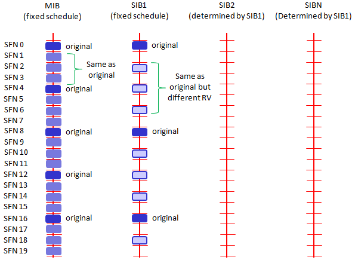
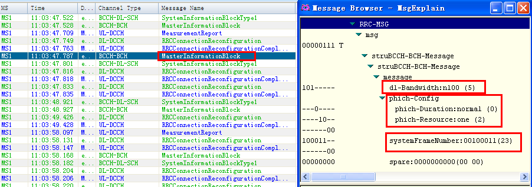

= 系统信息
=== 概述
LTE系统内分为MIB和SIB系列消息, 对于UE当新接入一个小区或广播消息发生改变时, 都会接收系统信息(MIB\SIB), 以帮助更新或纠正UE当前的状态, 完成相应的通信业务和物理过程. 在系统路测中可以观察的系统信息有种: MIB, SIB1和SI, 其作用分别如下. 

- MIB:用于系统接入. MIB上传输几个比较重要的系统信息参数, 如小区下行带宽, PHICH配置参数, 无线系统帧号SFN(包含SIB1消息的位置), 在PBCH上发送, 表现为"RRC_MASTER_INFO_BLOCK". 
- SIB1:广播小区接入与小区选择的相关参数以及SI消息的调度信息(包含了一个或多个SIB2-13消息), 在PDSCH上发送, 表现为"RRC_SIB_TYPE1". 
- SI:SI消息中承载的是SIB2-SIB13, 在PDSCH上发送, 表现为"RRC_SYS_INFO". 
* SIB2:小区内所有UE共用的无线参数配置, 其它无线参数基本配置. 
* SIB4:同频邻区列表以及每个邻区的重选参数, 同频白/黑名单小区列表. 
* SIB5:异频相邻频点列表以及每个频点的重选参数, 异频相邻小区列表以及每个邻区的重选参数, 异频黑名单小区列表. 
* SIB6:UTRA FDD邻频频点列表以及每个频点的重选参数, UTRA TDD邻频频点列表以及每个频点的重选参数. 
* SIB7:GERAN邻频频点列表以及每个频点的重选参数. 
* SIB8:CDMA2000的预注册信息, CDMA2000邻频频段列表和每个频段的重选参数, CDMA2000邻频频段的邻区列表. 
* SIB9:Home eNodeB的名称. 
* SIB10:ETWS主信息(primary notification). 
* SIB11:ETWS辅信息(secondary notification). 
* SIB12:CMAS信息(CMAS notification). 
* SIB13:请求获取跟一个或多个MBSFN区域相关的MBMS控制信息的信息. 

=== 系统信息(System Information)解析
==== MIB (Master Information Block)解析
MIB主要包含系统带宽, PHICH配置信息, 系统帧号. (下图为实测信令)

[glossary]
DL_Bandwidth::
系统带宽, 范围enumerate(1.4M(6RB, 0), 3M(15RB, 1), 5M(25RB, 2), 10M(50RB, 3), 15M(75RB, 4), 20M(100RB, 5)), 上图为n100, 对应的系统带宽为20M(100RB, 带宽索引号为5). 
Phich_Config::
- 参见 http://blog.sina.com.cn/s/blog_927cff010101bhbi.html[PHICH分析一]
- 参见 http://blog.sina.com.cn/s/blog_927cff010101bhck.html[PHICH分析二]

Phich_Duration::
当该参数设置为normal时, PDCCH占用的OFDM符号数可以自适应调整; 当该参数设置为extended时, 若带宽为1.4M, 则PDCCH占用的OFDM符号数可以取3或4, 对于其他系统带宽下, PDCCH占用的符号数只能为3. 

[align="center", width="90%", options="header"]
.Phich_Duration
|==============================================
^|             2+|非MBSFN子帧                       |MBSFN子帧
^|PHICH持续时间 |帧结构类型2中的子帧1和子帧6 |其他情况 |同时支持PDSCH和PMCH的载波
^|Normal       |1 |1 |1
^|Extended     |2 |3 |2
|==============================================

PHICH-Resource::
该参数用于计算小区PHICH信道的资源; 
SystemFrameNumber::
系统帧号. 系统帧号, 用于UE获取系统时钟. 实际SFN位长为10bit, 也就是取值从0-1023循环. 在PBCH的MIB广播中只广播前8位, 剩下的两位根据该帧在PBCH 40ms周期窗口的位置确定, 第一个10ms帧为00, 第二帧为01, 第三帧为10, 第四帧为11. PBCH的40ms窗口手机可以通过盲检确定. 
Spare::
预留的, 暂时未用

=== SIB1 (System Information Block 1) 解析
SIB1上主要传输评估UE能否接入小区的相关信息及其他系统信息的调度信息. 主要包括4部分: 

- 小区接入相关信息(cell Access Related Info)
* PLMN Identity List, PLMN Identity, TA Code, Cell identity & Cell Status
- 小区选择信息(cell Selection Info)
* Minimum Receiver Level
- 调度信息(scheduling Info List)
* SI message type & Periodicity, SIB mapping Info, SI Window length
- TDD配置信息(tdd-Config)

.SIB1
----
MS1
System Information Block Type1 (DL-BCCH-SCH)

Time : 15:57:43.004
Vendor Header
  Length : 47
  Log Code (Hex) : 0xB0C0
  HW Timestamp : (63622381.25 ms) 17:40:22.381
    1.25 ms fraction : 0.00
    CFN : 136
    1.25 ms counter : 867576017905
  RRC Signaling Header
    Log Packet Version : 2
    RRC Release Number : 9.5.0
    Radio Bearer Id : 0
    Physical Cell Id : 2
    E-ARFCN : 39150
    System Frame Number
      System frame number : N/A
      Sub frame number : N/A
    Message Type : BcchSchDownlink
    Message Length : 22
plmn-IdentityList                                     <1>
  PLMN-IdentityList :
    [0 ] :
      plmn-Identity
        mcc
          MCC :
            [0 ] : 0
            [1 ] : 0
            [2 ] : 1
        mnc
          MNC :
            [0 ] : 0
            [1 ] : 1
      cellReservedForOperatorUse : notReserved
trackingAreaCode : 12594 (0x3132)                     <2>
cellIdentity : 2 (0x2)                                <3>
cellBarred : notBarred                                <4>
intraFreqReselection : allowed                        <5>
csg-Indication : False                                <6>
q-RxLevMin : -65                                      <7>
q-RxLevMinOffset : 1                                  <8>
p-Max : 23                                            <9>
freqBandIndicator : 40                                <10>
schedulingInfoList                                    <11>
  SchedulingInfoList :
    [0 ] :
      si-Periodicity : rf16                           <12>
      sib-MappingInfo
        SIB-MappingInfo :
          [0 ] :
            extensionBit0 : 0
            Optionalitem : sibType3                   <13>
          [1 ] :
            extensionBit0 : 0
            Optionalitem : sibType5
    [1 ] :
      si-Periodicity : rf128
      sib-MappingInfo
        SIB-MappingInfo :
          [0 ] :
            extensionBit0 : 0
            Optionalitem : sibType6
          [1 ] :
            extensionBit0 : 0
            Optionalitem : sibType7
tdd-Config
  subframeAssignment : sa2                            <14>
  specialSubframePatterns : ssp7                      <15> 
si-WindowLength : ms20                                <16>
systemInfoValueTag : 0                                <17>

Message dump (Hex):
    70 40 04 03 31 32 00 00 00 29
    14 6B 38 48 80 28 21 91 3D 00
    00 00

----

<1> PLMN标识列表(0-6)
<2> TAC跟踪区(0-65546) 消息中(0x3132)为16进制数, 转换成十进制为12594
<3> 小区ID实际是ECI, 与核心网中的数据相同, 其中089055为ENB ID标识, 0A为小区标识(此数字必须是2位16进制数, 才能与16进制的ENB ID进行组合成ECI), 如果ENB ID和小区ID都是十进制数的话, ECI=10进制的ENB ID * 256+ 10进制cell ID
<4> 小区禁止: 小区是否禁止UE驻扎, notBarred表示不禁止
<5> 同频重选: 允许; 用来控制当更高级别的小区禁止接入时, 能否重选同频小区
<6> 指示这个小区是否为CSG小区. 当csg-Indication设置为1(true)时, 只有当消息中的CSG(Closed Subscriber Group关闭用户组)标识和UE中存储的CSG列表中的一项匹配时, 此UE才能接入小区. 这个主要是用在R9的家庭基站中的概念, 用于家庭基站对用户接入的控制. FALSE表示不启用. 
<7> 指示小区要求的最小接收功率RSRP(-140..-44)dBm, 即当UE测量小区RSRP低于该值时UE是无法在该小区驻留的. 实际的值为: Q~rxlevmin~ = IE value * 2[dB]
<8> 小区选择所需要的最小接收电平偏移,(2-16)dB 
//这个的作用不大理解
<9> 小区支持UE允许的最大发射功率,如果eNB配置大于UE支持最大值, UE就设置为UE支持的最大值. 例如Cat3 UE支持最大23db
<10> 频带指示, 表示当前系统的使用40频段
<11> 调度信息表
<12> SI消息的调度周期, 以无线帧为单位. 如rf16表示周期为16个无线帧
<13> 系统消息中所含的系统信息块映射表. 表中没有包含SIB2, 它一直包含在SI消息中的第一项. 该字段决定了该小区能下发的sib(3到11)类型. 以上调度信息表示SIB3的周期和位置. 
<14> 用于指示上下行子帧的配置, sa2对应配置2. 详见 <<tab_UD_conifg>>
<15> 特殊子帧配比. 详见 <<tab_special_conifg>>
<16> 系统消息调度窗口,20ms
<17> 指示其它SIB是否发生了改变 详见 <<si_value_tag, systemInfoValueTag解析>>

[[tab_UD_conifg]]
[align="center", width="90%"]
.TD LTE uplink-downlink configuration
|==============================================
.2+^|Uplink-downlink configuration .2+^|Downlink-to-Uplink Switch-point periodicity 10+^|Subframe number
         |0 |1 |2 |3 |4 |5 |6 |7 |8 |9 
|0 |5ms  |D |S |U |U |U |D |S |U |U |U
|1 |5ms  |D |S |U |U |D |D |S |U |U |D 
|2 |5ms  |D |S |U |D |D |D |S |U |D |D 
|3 |10ms |D |S |U |U |U |D |D |D |D |D 
|4 |10ms |D |S |U |U |D |D |D |D |D |D 
|5 |10ms |D |S |U |D |D |D |D |D |D |D 
|6 |5ms  |D |S |U |U |U |D |S |U |U |D 
|==============================================
// 配置6怎么说是5ms? 

[[tab_special_conifg]]
[align="center", width="90%"]
.TD LTE uplink-downlink configuration
|==============================================
.2+^|特殊子帧配置  3+^|Normal CP(常规CP)1ms14个码
| DwPTS | GP | UpPTS
| 0     | 3  | 10    | 1
| 1     | 9  | 4     | 1
| 2     | 10 | 3     | 1
| 3     | 11 | 2     | 1
| 4     | 12 | 1     | 1
| 5     | 3  | 9     | 2
| 6     | 0  | 3     | 2
| 7     | 10 | 2     | 2
| 8     | 11 | 1     | 2
| 9     | 6  | 6     | 2
|==============================================
// 配置6怎么说是5ms? 

[[si_value_tag, systemInfoValueTag解析]]
对于除MIB, SIB1, SIB10和SIB11之外的所有系统信息块的公共值, 范围(0-31); SI每变化一次, systemInfoValueTag值就加1(或减1: 移动研究院测试华为网络机制是减1). 

举例: UE将寻呼消息PAGING TYPE1中的MIB value tag1与自己保存的MIB value tag2进行比较:

1. 如果这两个Tag不同的话, 认为SI已经更新, 重新读取SI. 
2. 当重新获取得的systemInfoValueTag3与systemInfoValueTag1相同, 而systemInfoValueTag2不同的话, 读取MIB中的调度内容, 进行系统消息更新. 
3. 如果自己保存的systemInfoValueTag2与重新接收的systemInfoValueTag3相同, 而与寻呼消息中的systemInfoValueTag1不同的话, 认为MIB还没有广播下来, 等下一个MIB. 

=== SIB2 (System Information Block 2) 解析
....
MS1
System Information Block 2

Time : 17:45:31.000
ac-BarringForEmergency : False
ac-BarringForMO-Signalling
  ac-BarringFactor : p95
  ac-BarringTime : s8
  ac-BarringForSpecialAC : 00000
    [0 ] : 0
    [1 ] : 0
    [2 ] : 0
    [3 ] : 0
    [4 ] : 0
ac-BarringForMO-Data
  ac-BarringFactor : p95
  ac-BarringTime : s8
  ac-BarringForSpecialAC : 00000
    [0 ] : 0
    [1 ] : 0
    [2 ] : 0
    [3 ] : 0
    [4 ] : 0
radioResourceConfigCommon
  rach-ConfigCommon
    numberOfRA-Preambles : n52
    sizeOfRA-PreamblesGroupA : n44
    messageSizeGroupA : b56
    messagePowerOffsetGroupB : dB5
    powerRampingStep : dB2
    preambleInitialReceivedTargetPower : dBm-90
    preambleTransMax : n20
    ra-ResponseWindowSize : sf10
    mac-ContentionResolutionTimer : sf48
    maxHARQ-Msg3Tx : 8
  bcch-Config
    modificationPeriodCoeff : n4
  pcch-Config
    defaultPagingCycle : rf64
    nB : oneT
  prach-Config
    rootSequenceIndex : 22
    prach-ConfigInfo
      prach-ConfigIndex : 0
      highSpeedFlag : False
      zeroCorrelationZoneConfig : 1
      prach-FreqOffset : 10
  pdsch-ConfigCommon
    referenceSignalPower : -10
    p-b : 1
  pusch-ConfigCommon
    n-SB : 2
    hoppingMode : interSubFrame
    pusch-HoppingOffset : 6
    enable64QAM : True
    ul-ReferenceSignalsPUSCH
      groupHoppingEnabled : False
      groupAssignmentPUSCH : 0
      sequenceHoppingEnabled : False
      cyclicShift : 0
  pucch-ConfigCommon
    deltaPUCCH-Shift : ds1
    nRB-CQI : 2
    nCS-AN : 0
    n1PUCCH-AN : 2
  soundingRS-UL-ConfigCommon
    SoundingRS-UL-ConfigCommon : release
  uplinkPowerControlCommon
    p0-NominalPUSCH : -80
    alpha : al1
    p0-NominalPUCCH : -100
    deltaFList-PUCCH
      deltaF-PUCCH-Format1 : deltaF-2
      deltaF-PUCCH-Format1b : deltaF3
      deltaF-PUCCH-Format2 : deltaF-2
      deltaF-PUCCH-Format2a : deltaF2
      deltaF-PUCCH-Format2b : deltaF2
    deltaPreambleMsg3 : 4
  ul-CyclicPrefixLength : len1
ue-TimersAndConstants
  t300 : ms1000
  t301 : ms1000
  t310 : ms1000
  n310 : n1
  t311 : ms1000
  n311 : n8
additionalSpectrumEmission : 1
timeAlignmentTimerCommon : infinity

....

=== SIB3 (System Information Block 3) 解析
....
MS1
System Information Block 3

Time : 17:45:36.299
q-Hyst : dB3
s-NonIntraSearch : 22
threshServingLow : 15
cellReselectionPriority : 7
q-RxLevMin : -60
p-Max : 23
s-IntraSearch : 19
allowedMeasBandwidth : mbw100
presenceAntennaPort1 : False
neighCellConfig
  Binary string (Bin) : 01
    [0 ] : 0
    [1 ] : 1
t-ReselectionEUTRA : 1

....

=== SIB4 (System Information Block 4) 解析
....
MS1
System Information Block 4

Time : 10:01:27.846
intraFreqNeighCellList
  IntraFreqNeighCellList :
    [0 ] :
      physCellId : 14
      q-OffsetCell : dB0
    [1 ] :
      physCellId : 201
      q-OffsetCell : dB0

....

=== SIB5 (System Information Block 5) 解析
....
MS1
System Information Block 5

Time : 17:45:36.299
interFreqCarrierFreqList
  InterFreqCarrierFreqList :
    [0 ] :
      dl-CarrierFreq : 2
      q-RxLevMin : -65
      t-ReselectionEUTRA : 1
      threshX-High : 12
      threshX-Low : 11
      allowedMeasBandwidth : mbw100
      presenceAntennaPort1 : False
      cellReselectionPriority : 7
      neighCellConfig
        Binary string (Bin) : 00
          [0 ] : 0
          [1 ] : 0
....

// vim: set syntax=asciidoc:
